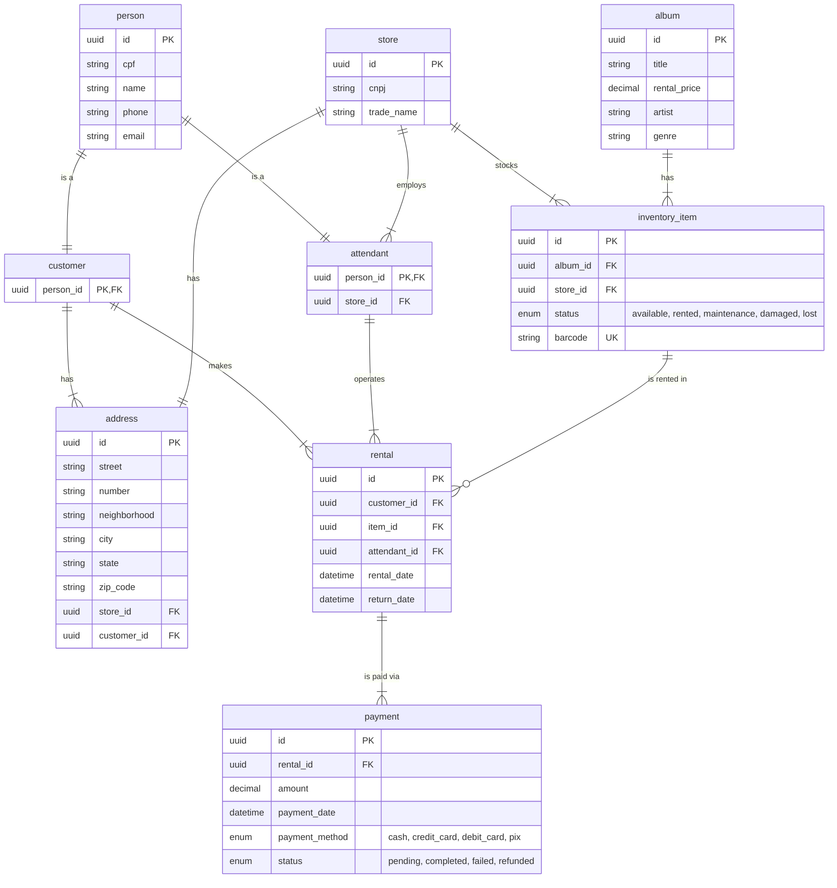

# ER DIAGRAM

```mermaid
erDiagram
    person {
        uuid id PK
        string cpf
        string name
        string phone
        string email
    }

    customer {
        uuid person_id PK,FK
    }

    attendant {
        uuid person_id PK,FK
        uuid store_id FK
    }

    store {
        uuid id PK
        string cnpj
        string trade_name
    }

    address {
        uuid id PK
        string street
        string number
        string neighborhood
        string city
        string state
        string zip_code
        uuid store_id FK
        uuid customer_id FK
    }

    album {
        uuid id PK
        string title
        decimal rental_price
        string artist
        string genre
    }

    inventory_item {
        uuid id PK
        uuid album_id FK
        uuid store_id FK
        enum status "available, rented, maintenance, damaged, lost"
        string barcode UK
    }

    rental {
        uuid id PK
        uuid customer_id FK
        uuid item_id FK
        uuid attendant_id FK
        datetime rental_date
        datetime return_date
    }

    payment {
        uuid id PK
        uuid rental_id FK
        decimal amount
        datetime payment_date
        enum payment_method "cash, credit_card, debit_card, pix"
        enum status "pending, completed, failed, refunded"
    }

    person ||--|| customer : "is a"
    person ||--|| attendant : "is a"

    customer ||--|{ rental : "makes"
    customer ||--|{ address : "has"
    attendant ||--|{ rental : "operates"
    
    store ||--|{ attendant : "employs"
    store ||--|| address : "has"
    store ||--|{ inventory_item : "stocks"

    album ||--|{ inventory_item : "has"
    inventory_item ||--o{ rental : "is rented in"
    
    rental ||--|{ payment : "is paid via"
```