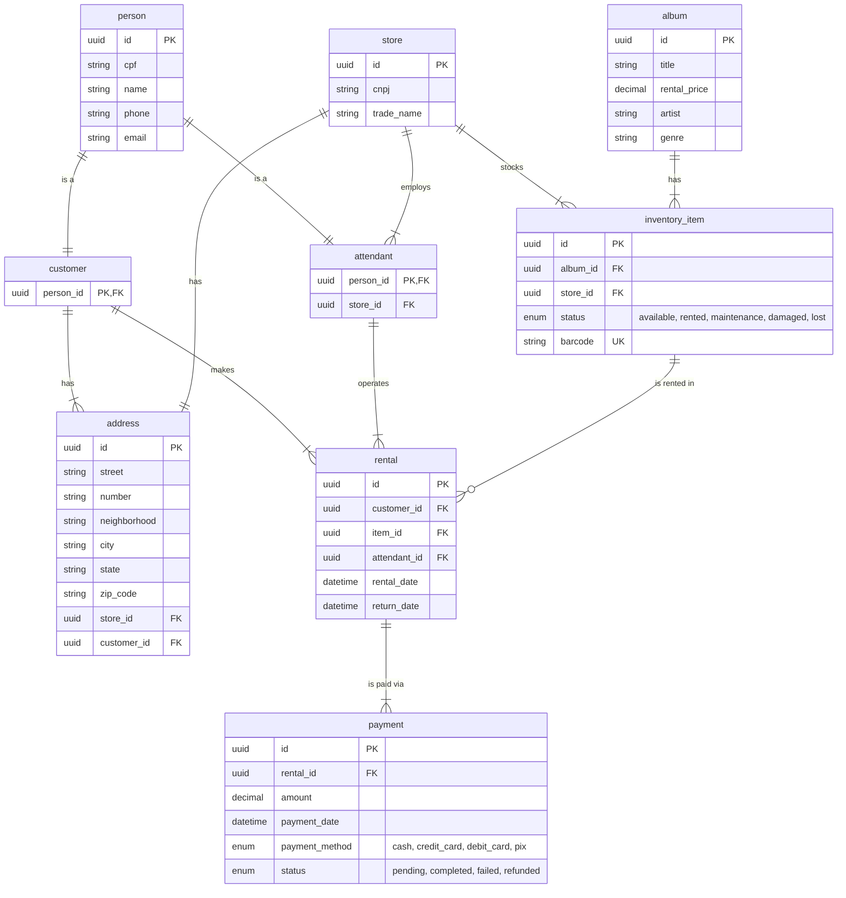

# Album Rental Store API


[](LICENSE)


## Table of Contents
- [Overview](#overview)
- [Stack](#stack)
- [Project Structure](#project-structure)
- [Design Patterns](#design-patterns)
- [Database Design](#database-design)
  - [ER Diagram](#er-diagram)
  - [DDL Script](#ddl-script)
  - [Database Schema Details](#database-schema-details)
    - [Core Design Principles](#core-design-principles)
    - [Key Relationships](#key-relationships)
- [Setup and Installation](#setup-and-installation)
  - [Prerequisites](#prerequisites)
  - [Installation Steps](#installation-steps)
- [Example usage](#example-usage)

## Overview
This is a Flask-based REST API for managing an album rental store system. The application manages customers, stores, albums, inventory items, rentals, and payments with a focus on robust data validation and relationship management.

## Stack
- Flask 3.1.1
- SQLAlchemy ORM
- PostgreSQL
- Flask-Migrate
- Flask-RestX
- Docker

## Project Structure
```
bd-loja/
├── app.py                    # Application entry point
├── requirements.txt          # Python dependencies
├── docker-compose.yaml       # PostgreSQL container
└── src/
    ├── config/
    │   └── database.py       # Database configuration
    ├── controllers/          # Business logic controllers
    ├── models/              # SQLAlchemy models
    ├── routes/              # API route definitions
    └── validators/          # Data validation layer
```

## Design Patterns
- **MVC Architecture**: Clear separation of concerns
- **Repository Pattern**: Base controller for common operations
- **Validation Layer**: Centralized validation logic
- **Blueprint Pattern**: Modular route organization

## Database Design

### ER Diagram


### DDL Script
```sql
-- Enable UUID extension
CREATE EXTENSION IF NOT EXISTS "uuid-ossp";

-- Create ENUM types
CREATE TYPE inventory_status AS ENUM ('available', 'rented', 'maintenance', 'damaged', 'lost');
CREATE TYPE payment_method AS ENUM ('cash', 'credit_card', 'debit_card', 'pix');
CREATE TYPE payment_status AS ENUM ('pending', 'completed', 'failed', 'refunded');

-- Create tables

-- Person table (base table for customer and attendant)
CREATE TABLE persons (
    id UUID PRIMARY KEY DEFAULT uuid_generate_v4(),
    cpf VARCHAR(11) UNIQUE NOT NULL,
    name VARCHAR(100) NOT NULL,
    phone VARCHAR(15) NOT NULL,
    email VARCHAR(100) NOT NULL UNIQUE,
    created_at TIMESTAMP DEFAULT CURRENT_TIMESTAMP,
    updated_at TIMESTAMP DEFAULT CURRENT_TIMESTAMP
);

-- Store table
CREATE TABLE stores (
    id UUID PRIMARY KEY DEFAULT uuid_generate_v4(),
    cnpj VARCHAR(14) UNIQUE NOT NULL,
    trade_name VARCHAR(100) NOT NULL,
    created_at TIMESTAMP DEFAULT CURRENT_TIMESTAMP,
    updated_at TIMESTAMP DEFAULT CURRENT_TIMESTAMP
);

-- Customer table (inherits from person)
CREATE TABLE customers (
    person_id UUID PRIMARY KEY,
    created_at TIMESTAMP DEFAULT CURRENT_TIMESTAMP,
    updated_at TIMESTAMP DEFAULT CURRENT_TIMESTAMP,
    
    CONSTRAINT fk_customer_person 
        FOREIGN KEY (person_id) 
        REFERENCES persons(id) 
        ON DELETE CASCADE
);

-- Attendant table (inherits from person)
CREATE TABLE attendants (
    person_id UUID PRIMARY KEY,
    store_id UUID NOT NULL,
    created_at TIMESTAMP DEFAULT CURRENT_TIMESTAMP,
    updated_at TIMESTAMP DEFAULT CURRENT_TIMESTAMP,
    
    CONSTRAINT fk_attendant_person 
        FOREIGN KEY (person_id) 
        REFERENCES persons(id) 
        ON DELETE CASCADE,
    
    CONSTRAINT fk_attendant_store 
        FOREIGN KEY (store_id) 
        REFERENCES stores(id) 
        ON DELETE RESTRICT
);

-- Address table
CREATE TABLE addresses (
    id UUID PRIMARY KEY DEFAULT uuid_generate_v4(),
    street VARCHAR(200) NOT NULL,
    number VARCHAR(10) NOT NULL,
    neighborhood VARCHAR(100) NOT NULL,
    city VARCHAR(100) NOT NULL,
    state VARCHAR(2) NOT NULL,
    zip_code VARCHAR(8) NOT NULL,
    store_id UUID,
    customer_id UUID,
    created_at TIMESTAMP DEFAULT CURRENT_TIMESTAMP,
    updated_at TIMESTAMP DEFAULT CURRENT_TIMESTAMP,
    
    CONSTRAINT fk_address_store 
        FOREIGN KEY (store_id) 
        REFERENCES stores(id) 
        ON DELETE CASCADE,
    
    CONSTRAINT fk_address_customer 
        FOREIGN KEY (customer_id) 
        REFERENCES customers(person_id) 
        ON DELETE CASCADE,
    
    -- Ensure address belongs to either store or customer (not both)
    CONSTRAINT chk_address_owner 
        CHECK (
            (store_id IS NOT NULL AND customer_id IS NULL) OR 
            (store_id IS NULL AND customer_id IS NOT NULL)
        )
);

-- Album table
CREATE TABLE albums (
    id UUID PRIMARY KEY DEFAULT uuid_generate_v4(),
    title VARCHAR(200) NOT NULL,
    rental_price DECIMAL(10,2) NOT NULL CHECK (rental_price > 0),
    artist VARCHAR(200) NOT NULL,
    genre VARCHAR(200) NOT NULL,
    created_at TIMESTAMP DEFAULT CURRENT_TIMESTAMP,
    updated_at TIMESTAMP DEFAULT CURRENT_TIMESTAMP
);

-- Inventory item table
CREATE TABLE inventory_items (
    id UUID PRIMARY KEY DEFAULT uuid_generate_v4(),
    album_id UUID NOT NULL,
    store_id UUID NOT NULL,
    status inventory_status NOT NULL DEFAULT 'available',
    barcode VARCHAR(200) UNIQUE NOT NULL,
    created_at TIMESTAMP DEFAULT CURRENT_TIMESTAMP,
    updated_at TIMESTAMP DEFAULT CURRENT_TIMESTAMP,
    
    CONSTRAINT fk_inventory_album 
        FOREIGN KEY (album_id) 
        REFERENCES albums(id) 
        ON DELETE RESTRICT,
    
    CONSTRAINT fk_inventory_store 
        FOREIGN KEY (store_id) 
        REFERENCES stores(id) 
        ON DELETE RESTRICT
);

-- Rental table
CREATE TABLE rentals (
    id UUID PRIMARY KEY DEFAULT uuid_generate_v4(),
    customer_id UUID NOT NULL,
    item_id UUID NOT NULL,
    attendant_id UUID NOT NULL,
    rental_date TIMESTAMP NOT NULL DEFAULT CURRENT_TIMESTAMP,
    return_date TIMESTAMP,
    created_at TIMESTAMP DEFAULT CURRENT_TIMESTAMP,
    updated_at TIMESTAMP DEFAULT CURRENT_TIMESTAMP,
    
    CONSTRAINT fk_rental_customer 
        FOREIGN KEY (customer_id) 
        REFERENCES customers(person_id) 
        ON DELETE RESTRICT,
    
    CONSTRAINT fk_rental_item 
        FOREIGN KEY (item_id) 
        REFERENCES inventory_items(id) 
        ON DELETE RESTRICT,
    
    CONSTRAINT fk_rental_attendant 
        FOREIGN KEY (attendant_id) 
        REFERENCES attendants(person_id) 
        ON DELETE RESTRICT,
    
    -- Ensure return_date is after rental_date when set
    CONSTRAINT chk_return_date 
        CHECK (return_date IS NULL OR return_date > rental_date)
);

-- Payment table
CREATE TABLE payments (
    id UUID PRIMARY KEY DEFAULT uuid_generate_v4(),
    rental_id UUID NOT NULL,
    amount DECIMAL(10,2) NOT NULL CHECK (amount > 0),
    payment_date TIMESTAMP NOT NULL DEFAULT CURRENT_TIMESTAMP,
    payment_method payment_method NOT NULL,
    status payment_status NOT NULL DEFAULT 'pending',
    created_at TIMESTAMP DEFAULT CURRENT_TIMESTAMP,
    updated_at TIMESTAMP DEFAULT CURRENT_TIMESTAMP,
    
    CONSTRAINT fk_payment_rental 
        FOREIGN KEY (rental_id) 
        REFERENCES rentals(id) 
        ON DELETE RESTRICT
);

-- Create indexes for better performance
CREATE INDEX idx_person_cpf ON persons(cpf);
CREATE INDEX idx_person_email ON persons(email);
CREATE INDEX idx_store_cnpj ON stores(cnpj);
CREATE INDEX idx_inventory_barcode ON inventory_items(barcode);
CREATE INDEX idx_inventory_status ON inventory_items(status);
CREATE INDEX idx_rental_customer ON rentals(customer_id);
CREATE INDEX idx_rental_item ON rentals(item_id);
CREATE INDEX idx_rental_attendant ON rentals(attendant_id);
CREATE INDEX idx_rental_date ON rentals(rental_date);
CREATE INDEX idx_payment_rental ON payments(rental_id);
CREATE INDEX idx_payment_status ON payments(status);
CREATE INDEX idx_address_store ON addresses(store_id);
CREATE INDEX idx_address_customer ON addresses(customer_id);

-- Create triggers for updating timestamps
CREATE OR REPLACE FUNCTION update_updated_at_column()
RETURNS TRIGGER AS $$
BEGIN
    NEW.updated_at = CURRENT_TIMESTAMP;
    RETURN NEW;
END;
$$ language 'plpgsql';

CREATE TRIGGER update_person_updated_at 
    BEFORE UPDATE ON persons 
    FOR EACH ROW EXECUTE FUNCTION update_updated_at_column();

CREATE TRIGGER update_store_updated_at 
    BEFORE UPDATE ON stores 
    FOR EACH ROW EXECUTE FUNCTION update_updated_at_column();

CREATE TRIGGER update_customer_updated_at 
    BEFORE UPDATE ON customers 
    FOR EACH ROW EXECUTE FUNCTION update_updated_at_column();

CREATE TRIGGER update_attendant_updated_at 
    BEFORE UPDATE ON attendants 
    FOR EACH ROW EXECUTE FUNCTION update_updated_at_column();

CREATE TRIGGER update_address_updated_at 
    BEFORE UPDATE ON addresses 
    FOR EACH ROW EXECUTE FUNCTION update_updated_at_column();

CREATE TRIGGER update_album_updated_at 
    BEFORE UPDATE ON albums 
    FOR EACH ROW EXECUTE FUNCTION update_updated_at_column();

CREATE TRIGGER update_inventory_item_updated_at 
    BEFORE UPDATE ON inventory_items 
    FOR EACH ROW EXECUTE FUNCTION update_updated_at_column();

CREATE TRIGGER update_rental_updated_at 
    BEFORE UPDATE ON rentals 
    FOR EACH ROW EXECUTE FUNCTION update_updated_at_column();

CREATE TRIGGER update_payment_updated_at 
    BEFORE UPDATE ON payments 
    FOR EACH ROW EXECUTE FUNCTION update_updated_at_column();
```

### Database Schema Details

#### Core Design Principles
1. **UUID Primary Keys**: All entities use UUID for better scalability and security
2. **Inheritance Pattern**: Person entity with Customer and Attendant specializations
3. **Audit Trail**: All models include `created_at` and `updated_at` timestamps
4. **Data Integrity**: Comprehensive constraints and foreign key relationships
5. **Enumerated Values**: Status fields use enums for data consistency

#### Key Relationships
- **Person → Customer/Attendant**: One-to-one inheritance relationship
- **Store → Attendant**: One-to-many (store has multiple attendants)
- **Store → Address**: One-to-one (each store has one address)
- **Store → InventoryItem**: One-to-many (store stocks multiple items)
- **Album → InventoryItem**: One-to-many (album has multiple copies)
- **Customer → Rental**: One-to-many (customer makes multiple rentals)
- **InventoryItem → Rental**: One-to-many (item can be rented multiple times)
- **Rental → Payment**: One-to-many (rental can have multiple payments)

## Setup and Installation

### Prerequisites
- Python 3.10+
- Docker and Docker Compose
- PostgreSQL (if not using Docker)

### Installation Steps

1. **Clone the repository**
```bash
git clone https://github.com/joaomarcosmb/cd-rental
cd cd-rental
```

2. **Install Python dependencies**
```bash
pip install -r requirements.txt
```

3. **Start PostgreSQL with Docker**
```bash
docker-compose up -d
```

4. **Run the application**
```bash
python app.py
```

The API will be available at `http://localhost:5000`. Swagger UI will be available at `http://localhost:5000/docs/`, where you can test the endpoints.

## Example usage

### Step 1: Create a Store

```bash
curl -X POST http://localhost:5001/api/stores \
  -H "Content-Type: application/json" \
  -d '{
    "cnpj": "12345678000195",
    "trade_name": "Best Music Store"
  }'
```

### Step 2: Create Store Address

```bash
curl -X POST http://localhost:5001/api/addresses \
  -H "Content-Type: application/json" \
  -d '{
    "street": "Rua Pernambuco",
    "number": "1440",
    "neighborhood": "Pici",
    "city": "Fortaleza",
    "state": "CE",
    "zip_code": "60160000",
    "store_id": "STORE_ID_HERE"
  }'
```

### Step 3: Create an Attendant 

```bash
curl -X POST http://localhost:5001/api/attendants \
  -H "Content-Type: application/json" \
  -d '{
    "cpf": "12345678901",
    "name": "Eduarda Silveira",
    "phone": "85990116278",
    "email": "eduarda.silveira@bestmusicstore.com",
    "store_id": "STORE_ID_HERE"
  }'
```

### Step 4: Create an Album

```bash
curl -X POST http://localhost:5001/api/albums \
  -H "Content-Type: application/json" \
  -d '{
    "title": "1989 - Taylor's Version",
    "artist": "Taylor Swift",
    "genre": "Pop",
    "rental_price": 29.99
  }'
```

### Step 5: Create Inventory Item (CD Copy)

```bash
curl -X POST http://localhost:5001/api/inventory-items \
  -H "Content-Type: application/json" \
  -d '{
    "barcode": "123456789012",
    "album_id": "ALBUM_ID_HERE",
    "store_id": "STORE_ID_HERE",
    "status": "available"
  }'
```

### Step 6: Create Customer (Signup)

```bash
curl -X POST http://localhost:5001/api/customers \
  -H "Content-Type: application/json" \
  -d '{
    "cpf": "98765432100",
    "name": "João Pereira",
    "phone": "85990636278",
    "email": "joao.pereira@email.com"
  }'
```

### Step 7: Create Customer Address

```bash
curl -X POST http://localhost:5001/api/addresses \
  -H "Content-Type: application/json" \
  -d '{
    "street": "Rua 862",
    "number": "281",
    "neighborhood": "Conjunto Esperança",
    "city": "Fortaleza",
    "state": "CE",
    "zip_code": "60160000",
    "customer_id": "CUSTOMER_ID_HERE"
  }'
```

### Step 8: Create Rental

```bash
curl -X POST http://localhost:5001/api/rentals \
  -H "Content-Type: application/json" \
  -d '{
    "customer_id": "CUSTOMER_ID_HERE",
    "item_id": "ITEM_ID_HERE",
    "attendant_id": "ATTENDANT_ID_HERE"
  }'
```

### Step 9: Create Payment

```bash
curl -X POST http://localhost:5001/api/payments \
  -H "Content-Type: application/json" \
  -d '{
    "rental_id": "RENTAL_ID_HERE",
    "amount": 29.99,
    "payment_method": "pix",
    "status": "completed"
  }'
```

### Step 10: Return the CD
```bash
curl -X POST http://localhost:5001/api/rentals/RENTAL_ID_HERE/return \
  -H "Content-Type: application/json" \
  -d ''
```