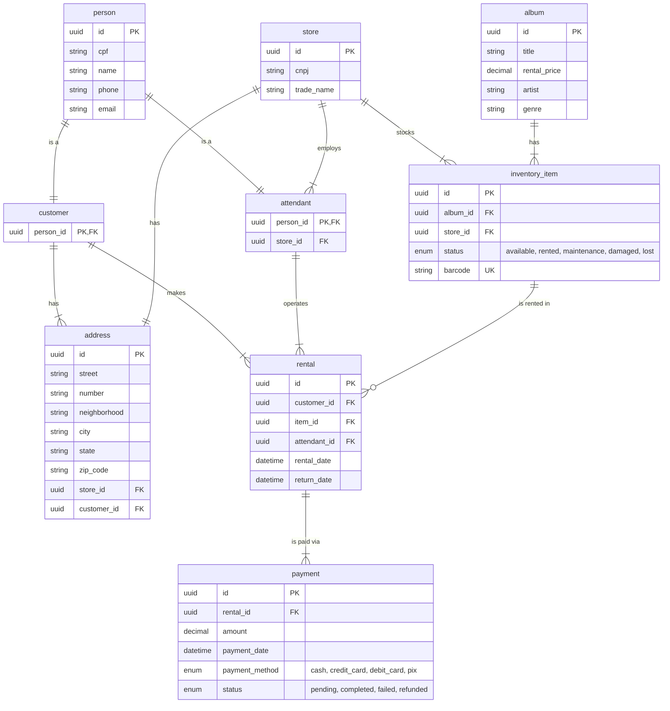

# Album Rental Store API


[](LICENSE)


## Table of Contents
- [Overview](#overview)
- [Stack](#stack)
- [Project Structure](#project-structure)
- [Design Patterns](#design-patterns)
- [Database Design](#database-design)
  - [ER Diagram](#er-diagram)
  - [Database Schema Details](#database-schema-details)
    - [Core Design Principles](#core-design-principles)
    - [Key Relationships](#key-relationships)
- [API Endpoints](#api-endpoints)
  - [Person Endpoints](#person-endpoints)
  - [Customer Endpoints](#customer-endpoints)
  - [Attendant Endpoints](#attendant-endpoints)
  - [Store Endpoints](#store-endpoints)
  - [Address Endpoints](#address-endpoints)
  - [Album Endpoints](#album-endpoints)
  - [Inventory Item Endpoints](#inventory-item-endpoints)
  - [Rental Endpoints](#rental-endpoints)
  - [Payment Endpoints](#payment-endpoints)
- [Setup and Installation](#setup-and-installation)
  - [Prerequisites](#prerequisites)
  - [Installation Steps](#installation-steps)

## Overview
This is a Flask-based REST API for managing an album rental store system. The application manages customers, stores, albums, inventory items, rentals, and payments with a focus on robust data validation and relationship management.

## Stack
- Flask 3.1.1
- SQLAlchemy ORM
- PostgreSQL
- Flask-Migrate
- Docker

## Project Structure
```
bd-loja/
├── app.py                    # Application entry point
├── requirements.txt          # Python dependencies
├── docker-compose.yaml       # PostgreSQL container
└── src/
    ├── config/
    │   └── database.py       # Database configuration
    ├── controllers/          # Business logic controllers
    ├── models/              # SQLAlchemy models
    ├── routes/              # API route definitions
    └── validators/          # Data validation layer
```

## Design Patterns
- **MVC Architecture**: Clear separation of concerns
- **Repository Pattern**: Base controller for common operations
- **Validation Layer**: Centralized validation logic
- **Blueprint Pattern**: Modular route organization

## Database Design

### ER Diagram


### Database Schema Details

#### Core Design Principles
1. **UUID Primary Keys**: All entities use UUID for better scalability and security
2. **Inheritance Pattern**: Person entity with Customer and Attendant specializations
3. **Audit Trail**: All models include `created_at` and `updated_at` timestamps
4. **Data Integrity**: Comprehensive constraints and foreign key relationships
5. **Enumerated Values**: Status fields use enums for data consistency

#### Key Relationships
- **Person → Customer/Attendant**: One-to-one inheritance relationship
- **Store → Attendant**: One-to-many (store has multiple attendants)
- **Store → Address**: One-to-one (each store has one address)
- **Store → InventoryItem**: One-to-many (store stocks multiple items)
- **Album → InventoryItem**: One-to-many (album has multiple copies)
- **Customer → Rental**: One-to-many (customer makes multiple rentals)
- **InventoryItem → Rental**: One-to-many (item can be rented multiple times)
- **Rental → Payment**: One-to-many (rental can have multiple payments)

## API Endpoints

All endpoints follow RESTful conventions with the base URL pattern `/api/{resource}`.

### Person Endpoints
**Base URL**: `/api/persons`

| Method | Endpoint | Description |
|--------|----------|-------------|
| GET | `/` | Get all persons |
| GET | `/{id}` | Get person by ID |
| POST | `/` | Create new person |
| PUT | `/{id}` | Update person |
| DELETE | `/{id}` | Delete person |

### Customer Endpoints
**Base URL**: `/api/customers`

| Method | Endpoint | Description |
|--------|----------|-------------|
| GET | `/` | Get all customers |
| GET | `/{id}` | Get customer by ID |
| POST | `/` | Create new customer |
| PUT | `/{id}` | Update customer |
| DELETE | `/{id}` | Delete customer |

### Attendant Endpoints
**Base URL**: `/api/attendants`

| Method | Endpoint | Description |
|--------|----------|-------------|
| GET | `/` | Get all attendants |
| GET | `/{id}` | Get attendant by ID |
| POST | `/` | Create new attendant |
| PUT | `/{id}` | Update attendant |
| DELETE | `/{id}` | Delete attendant |

### Store Endpoints
**Base URL**: `/api/stores`

| Method | Endpoint | Description |
|--------|----------|-------------|
| GET | `/` | Get all stores |
| GET | `/{id}` | Get store by ID |
| POST | `/` | Create new store |
| PUT | `/{id}` | Update store |
| DELETE | `/{id}` | Delete store |

### Address Endpoints
**Base URL**: `/api/addresses`

| Method | Endpoint | Description |
|--------|----------|-------------|
| GET | `/` | Get all addresses |
| GET | `/{id}` | Get address by ID |
| POST | `/` | Create new address |
| PUT | `/{id}` | Update address |
| DELETE | `/{id}` | Delete address |

### Album Endpoints
**Base URL**: `/api/albums`

| Method | Endpoint | Description |
|--------|----------|-------------|
| GET | `/` | Get all albums |
| GET | `/{id}` | Get album by ID |
| POST | `/` | Create new album |
| PUT | `/{id}` | Update album |
| DELETE | `/{id}` | Delete album |
| GET | `/search?title={title}&artist={artist}&genre={genre}` | Search albums |
| GET | `/artist/{artist}` | Get albums by artist |
| GET | `/genre/{genre}` | Get albums by genre |

### Inventory Item Endpoints
**Base URL**: `/api/inventory-items`

| Method | Endpoint | Description |
|--------|----------|-------------|
| GET | `/` | Get all inventory items |
| GET | `/{id}` | Get item by ID |
| POST | `/` | Create new inventory item |
| PUT | `/{id}` | Update inventory item |
| DELETE | `/{id}` | Delete inventory item |
| GET | `/barcode/{barcode}` | Get item by barcode |
| GET | `/store/{store_id}` | Get items by store |
| GET | `/album/{album_id}` | Get items by album |
| GET | `/status/{status}` | Get items by status |
| GET | `/available` | Get available items |
| POST | `/{id}/rent` | Mark item as rented |
| POST | `/{id}/return` | Mark item as returned |

### Rental Endpoints
**Base URL**: `/api/rentals`

| Method | Endpoint | Description |
|--------|----------|-------------|
| GET | `/` | Get all rentals |
| GET | `/{id}` | Get rental by ID |
| POST | `/` | Create new rental |
| PUT | `/{id}` | Update rental |
| DELETE | `/{id}` | Delete rental |
| POST | `/{id}/return` | Mark rental as returned |
| GET | `/active` | Get active rentals |
| GET | `/returned` | Get returned rentals |

### Payment Endpoints
**Base URL**: `/api/payments`

| Method | Endpoint | Description |
|--------|----------|-------------|
| GET | `/` | Get all payments |
| GET | `/{id}` | Get payment by ID |
| POST | `/` | Create new payment |
| PUT | `/{id}` | Update payment |
| DELETE | `/{id}` | Delete payment |
| POST | `/{id}/complete` | Mark payment as completed |
| POST | `/{id}/fail` | Mark payment as failed |
| GET | `/status/{status}` | Get payments by status |
| GET | `/method/{method}` | Get payments by method |

## Setup and Installation

### Prerequisites
- Python 3.10+
- Docker and Docker Compose
- PostgreSQL (if not using Docker)

### Installation Steps

1. **Clone the repository**
```bash
git clone https://github.com/joaomarcosmb/cd-rental
cd cd-rental
```

2. **Install Python dependencies**
```bash
pip install -r requirements.txt
```

3. **Start PostgreSQL with Docker**
```bash
docker-compose up -d
```

4. **Run the application**
```bash
python app.py
```

The API will be available at `http://localhost:5000`