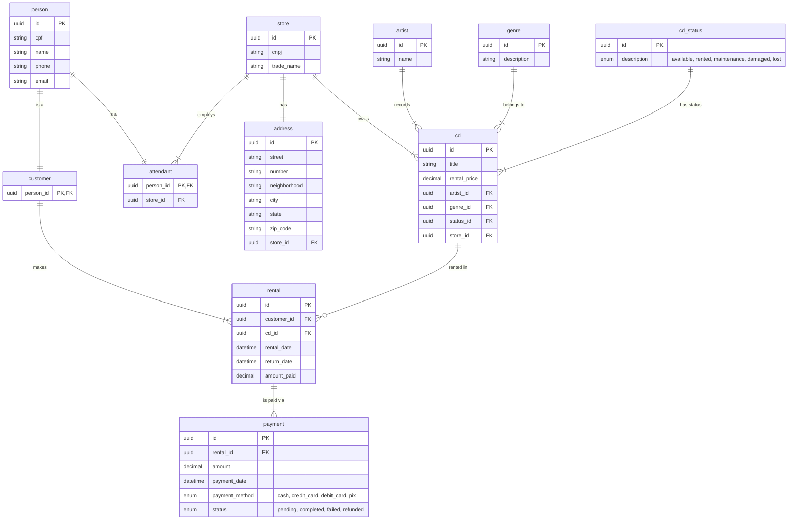

# ER DIAGRAM

```mermaid
erDiagram
    person {
        uuid id PK
        string cpf
        string name
        string phone
        string email
    }

    customer {
        uuid person_id PK,FK
    }

    attendant {
        uuid person_id PK,FK
        uuid store_id FK
    }

    store {
        uuid id PK
        string cnpj
        string trade_name
    }

    address {
        uuid id PK
        string street
        string number
        string neighborhood
        string city
        string state
        string zip_code
        uuid store_id FK
    }

    cd {
        uuid id PK
        string title
        decimal rental_price
        uuid artist_id FK
        uuid genre_id FK
        uuid status_id FK
        uuid store_id FK
    }

    rental {
        uuid id PK
        uuid customer_id FK
        uuid cd_id FK
        datetime rental_date
        datetime return_date
        decimal amount_paid
    }

    artist {
        uuid id PK
        string name
    }

    genre {
        uuid id PK
        string description
    }

    cd_status {
        uuid id PK
        enum description "available, rented, maintenance, damaged, lost"
    }

    payment {
        uuid id PK
        uuid rental_id FK
        decimal amount
        datetime payment_date
        enum payment_method "cash, credit_card, debit_card, pix"
        enum status "pending, completed, failed, refunded"
    }

    person ||--|| customer : "is a"
    person ||--|| attendant : "is a"
    
    store ||--|{ attendant : "employs"
    store ||--|| address : "has"
    store ||--|{ cd : "owns"

    artist ||--|{ cd : "records"
    genre ||--|{ cd : "belongs to"
    cd_status ||--|{ cd : "has status"

    customer ||--|{ rental : "makes"
    cd ||--o{ rental : "rented in"
    
    rental ||--|{ payment : "is paid via"
```